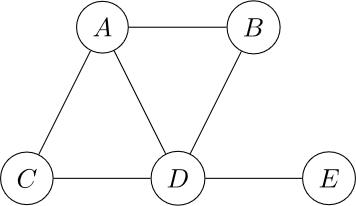

# Utils

Esta carpeta contiene algunas funciones útiles, principalmente para ver si un ejercicio propuesto es demasiado largo 
de resolver. Por ejemplo, si uno plantea un ejercicio de Branch & Bound para un parcial, está bueno corroborar que 
no será demasiado largo de resolver para les alumnes. Corroborar esto a mano puede ser tedioso si uno debe iterar el 
ejercicio propuesto. Las funciones implementadas en los archivos de esta carpeta buscan simplificar el proceso.

## `branch_and_bound.py`

Dado un problema de Programación Lineal Entera en dos variables, la fución `branch_and_bound` genera el árbol de Branch
& Bound. El propósito de esta función es ver rápidamente si un ejercicio de Branch & Bound requiere la resolución
de muchos subproblemas (es decir, si el ejercicio resultaría ser muy largo).

La función `branch_and_bound` requiere como input `A` la matriz del problema, `b` el vector de términos 
independientes, `c` el vector de coeficientes, `ineq` una lista con las desigualdades correspondientes a cada fila 
de `A`, `obj` el objetivo de optimización (`max` o `min`) y un argumento opcional `force_branch` que indica en qué 
variable ramificar luego de resolver la primera relajación lineal.

Las (des)igualdades de `ineq` vienen dadas por strings: `g` representa `>=`, `l` representa `<=` y `e` representa 
`=`. Se debe cumplir que `len(ineq) == A.shape[0]`.

La implementación actual de la resolución de la relajación lineal requiere tener instalado CPLEX (la versión de 
prueba es suficiente).  En el futuro reemplazaré CPLEX por un solver más conveniente. También requiere tener 
instalado [GraphViz](https://graphviz.org/) para visualizar correctamente el árbol de B&B.
### Ejemplo de uso

Para resolver el siguiente problema de Programación Lineal Entera:
$$\begin{array}{rrrrrrrrc}
\max & 3x_1 & + & 4x_2 &  &   \\
\text{s.a:}	 & 2x_1 & + & x_2 & \leq & 14  \\
			 & 2x_1 & + & 3x_2 & \leq & 17 \\
			 &2x_1 & +  & 2x_2 & \leq & 15 \\
			 & x_1  & & & \geq & 0 \\
             &  &  & x_2 & \geq & 0 \\
			 & x_1, & x_2 & \in & \mathbb{Z}
\end{array}
$$
```python
import numpy as np
from utils.branch_and_bound import branch_and_bound

A = np.array([[2 , 1],
              [2, 3],
              [2, 2],
              [1, 0],
              [0, 1]
              ])
b = np.array([14, 17, 15, 0, 0])
c = np.array([3, 4])
ineq = 'lllgg'

branch_and_bound(A, b, c, ineq, 'max')
```

## `coloreo.py`

Brinda la función `zykov_tree`, que ejecuta el algoritmo de conexion-contraccion y devuelve la cantidad de grafos en 
el árbol del algoritmo y el numérico cromático del grafo.
Está pensado para corroborar que un ejercicio de conexión-contracción no sea demasiado largo para
resolver si no se utiliza poda (i.e. si se busca el polinomio cromático).

El argumento de la función `zykov_tree` es el grafo $G$ como `networkx.Graph`.

### Ejemplo de uso

Sea el siguiente grafo $G$:



```python
import networkx as nx
from utils.coloreo import zykov_tree

G = nx.Graph()
E = {('a', 'b'), ('a', 'c'), ('a', 'd'), ('b', 'd'), ('c', 'd'), ('d', 'e')}
G.add_edges_from(E)

num_crom, ls = zykov_tree(G)
print(num_crom, len(ls))
```

## `matrix_to_latex`

Implementa la función `matrix_to_latex` para simplificar la escritura de los problemas de Programación Lineal para
ejercicios y parciales. La función `matrix_to_latex` requiere como input `A` la matriz del problema, `b` el vector de 
términos 
independientes, `c` el vector de coeficientes, `ineq` una lista con las desigualdades correspondientes a cada fila 
de `A` y `obj` el objetivo de optimización (`max` o `min`).

### Ejemplo de uso

El siguiente código

```python
import numpy as np
from utils.matrix_to_latex import matrix_to_latex

A = np.array([[2, 1, -2, 1],
              [0, -1, 3, -2]])
b = np.array([10, -8])
c = np.array([3, 1, -4, 2])
ineq = 'gl'
obj = 'max'
```

Imprime el código en latex del modelo:

$$
\begin{array}{rrcl}
\max & z = 3x_1+x_2-4x_3+2x_4 \\
s.a: & 2x_1+x_2-2x_3+x_4 & \geq & 10 \\
 & -x_2+3x_3-2x_4 & \leq & -8 \\
\end{array}
$$